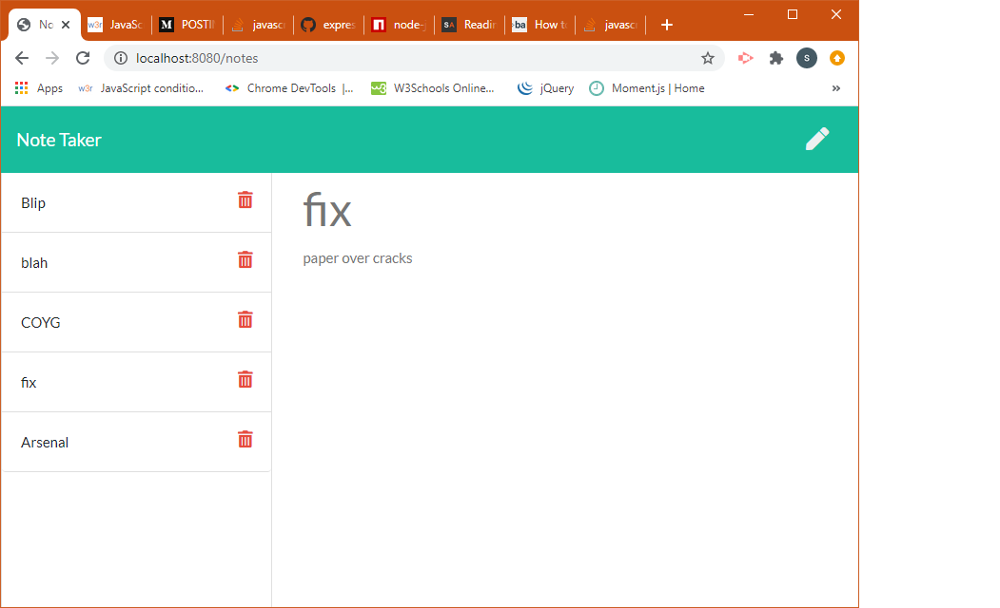
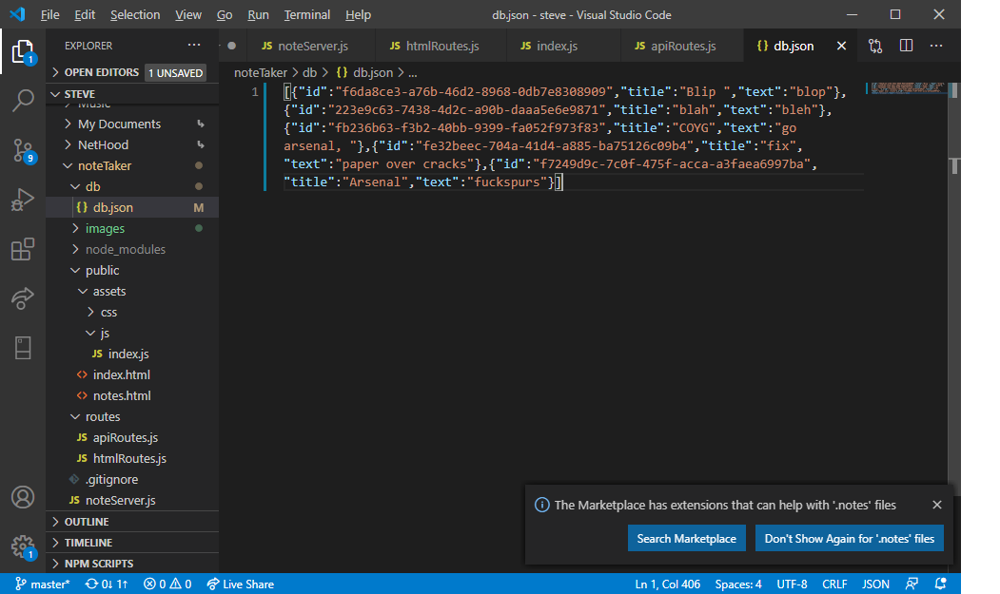

# Note Taker

## Description 
 Allows user to write and save notes to a json database, and to delete them.
 ### Images
 
 
 ### Deployment
 [Heroku Deployment](https://warm-hollows-19672.herokuapp.com/)
## Table of contents 
 - [Installation](#installation) 
 - [Usage](#usage) 
 - [contributing](#contributing) 
 - [Tests](#tests) 
## Installation 
 Git pull or download.
## Usage 
 Once project is installed, run on node. Open in browser on localhost:8080. 
## License 
 
## Contributing 
 Steven Schaab 
## Tests 
 N/A 
## Questions 
 - [Github](https://github.com/Raygun2thehead) 
 - [Email](mailto:stevenes83@gmail.com)
